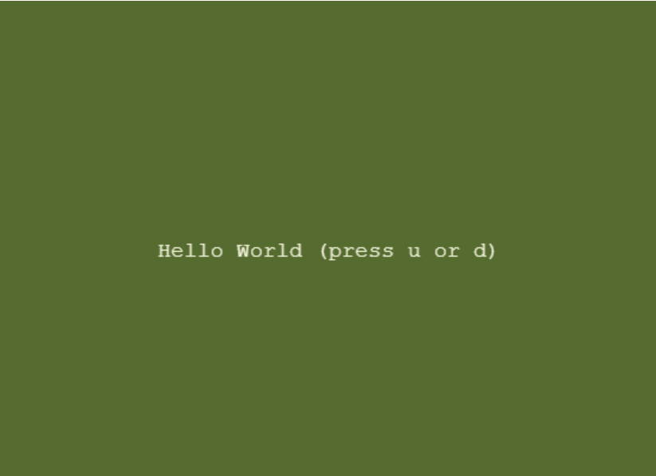
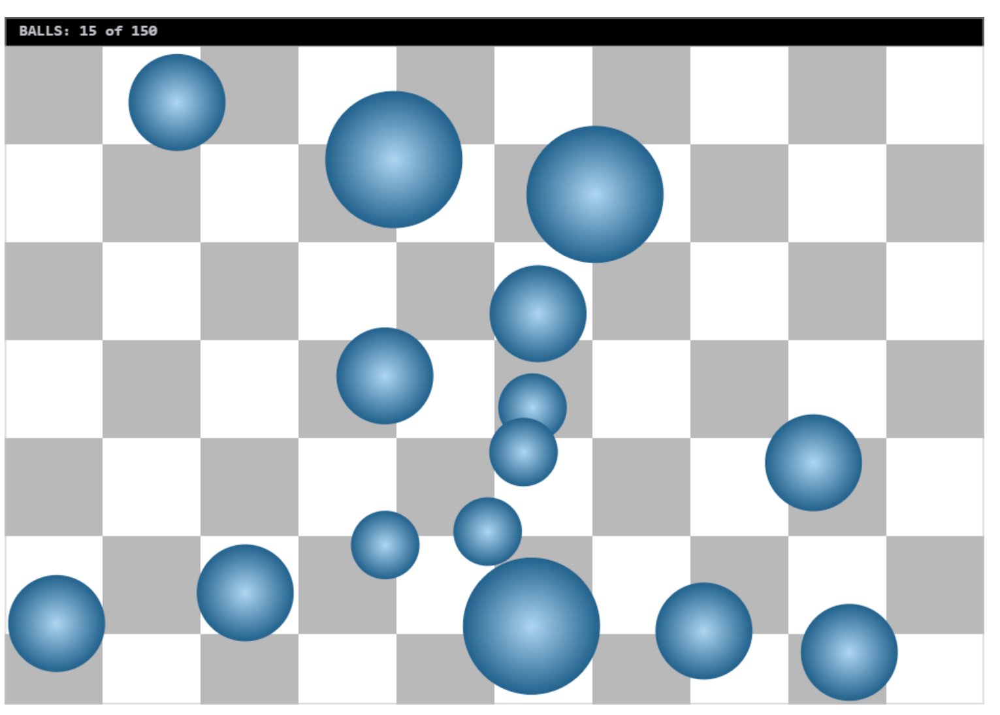

# Tiny Web Assembly Runtime
tiny-wasm-runtime allows you to run C/C++ code in a web browser. Legacy code,  libraries, full applications, or single functions can be integrated with Javascript.

tiny-wasm-runtime is "tiny" compared to other options, but has what is needed for many use cases, and is simple, and easy to understand.  You might also prefer tiny-wasm-runtime's method of JavaScript integration.  

# Hello World
Here is the simplest tiny-wasm-runtime example.

C code:

~~~
   #include <stdio.h>

   void hello() {
      printf("hello world\n");
   }
~~~

index.html:
~~~
<!doctype html>
<head>
	<title>Hello World</title>
</head>
<body>
	

	
</body>
</html>
~~~
# Table of Contents
- [Overview](#overview)
  - [The Web Assembly Runtime Problem](#the-web-assembly-runtime-problem)
  - [Key tiny-wasm-runtime Features](#key-tiny-wasm-runtime-features)
  - [Version 0.9.9 Limitations](#version-099-limitations)
- [Installation](#installation)
- [Examples](#examples)
  - [stdio-div - Print and input from a \<div\>](#stdio-div---print-and-input-from-a-div)
  - [FFT - Integrate C library with Typescript/Javascript](#fft---integrate-c-library-with-typescriptjavascript)
  - [stdio-canvas - Print and input from a canvas "terminal" window](#stdio-canvas---print-and-input-from-a-canvas-terminal-window)
  - [Balls - 2D Draw API and C++ Canvas class](#balls---2d-draw-api-and-c-canvas-class)
  - [Maze - Win32 Port using 2D API](#maze---win32-port-using-2d-api)
  - [Building the Examples](#building-the-examples)
- [Getting Started](#getting-started)
  - [Overview of steps to integrate your C code with your JavaScript code](#overview-of-steps-to-integrate-your-c-code-with-your-javascript-code)
  - [Example Hello World Make File](#example-hello-world-make-file)
  - [Memory](#memory)
  - [Debugging your C code](#debugging-your-c-code)
- [TypeScript-JavaScript API Overview](#typescript-javascript-api-overview)
  - [twrWasmModule and twrWasmModuleAsync](#twrwasmmodule-and-twrwasmmoduleasync)
  - [loadWasm](#loadwasm)
  - [executeC](#executec)
  - [Key input](#key-input)
  - [Options](#options)
  - [divLog](#divlog)
  - [Accessing Data in the Web Assembly Memory](#accessing-data-in-the-web-assembly-memory)
- [C API Overview](#c-api-overview)
  - [Passing strings, arrayBuffers, etc](#passing-strings-arraybuffers-etc)
  - [General functions](#general-functions)
  - [Draw 2D functions](#draw-2d-functions)
  - [Console I/O](#console-io)
  - [Standard C library](#standard-c-library)
- [Using Chrome to test without an HTTP server](#using-chrome-to-test-without-an-http-server)
- [Important production deployment note](#important-production-deployment-note)
- [To Build Source with Windows](#to-build-source-with-windows)

# Overview
## The Web Assembly Runtime Problem
HTML browsers can load a Web Assembly module, and execute it's bytecode in a browser virtual machine.  You compile your code using clang with the target code format being web assembly (wasm) byte code.   There are a few issues that one immediately encounters trying to execute code that is more complicated than squaring a number.  

The first is that there is no runtime support native to a Web Assembly module.  That is, no malloc or printf or similar functions.  Even beyond than that, there are no included compiler support  functions.  That is, clang code generation will produce calls for floating point support functions, memcpy, and other utility code.  This code is usually handled behind the scenes for you.  For example, gcc will link to the "gcc" lib automatically.  clang typically uses "compile-rt".  This doesn't happen with Web Assembly compiles (unless you use a wasm runtime like emscripten or tiny-wasm-runtime).

The second problem is that all the function calls between your wasm module and your javascript are limited to parameters and return values that are numbers (integer and float). No strings, arrays, struct pointers, etc.

The third problem is that legacy C code or games often block, and when written this way they don't naturally integrate with the Javascript asynchronous programming model.

tiny-wasm-runtime is a static C library (twr.a) that you can link to your clang C/C++ code, as well as a set of Javascript/Typescript modules that solve these issues.

## Key tiny-wasm-runtime Features
   - A subset of the standard C runtime, including printf, malloc, string functions, etc.
   - load web assembly modules, and call exported functions from JavaScript (with parameter conversion as needed)
   - Print and get characters to/from \<div\> tags in your HTML page
   - Print and get character to/from a \<canvas\> based "terminal".
   - Use 2D drawing API in C that are compatible with JavaScript Canvas
   - Allows traditional "blocking big loop" C code structure to be used with Javascript's asynchronous event model (via use of a worker thread.)
   -  a subset of the most common compiler utility functions. 
   -  small library overhead.  linked with helloworld,  code+data < 3K
   
## Version 0.9.9 Limitations 
   - Not all ansi stdlib functions are implemented
   - C++ std not supported
   - C++ global constructors not called (no cstart yet)
   - Most string functions use ASCII, not for example, UTF-8
   - Designed to work with a browser.  Not tested with or designed to work easily with node.js  
   - Has only been tested with chrome
   - Not all of compile-rt is ported

Please post feedback (it worked for you, didn't work, requests, questions, etc) at https://github.com/twiddlingbits/tiny-wasm-runtime/

# Installation
~~~
   npm install tiny-wasm-runtime
~~~

 **Installs for your C/C++ code**

  To build C code for use in your wasm project, you will need to install clang and the wasm-ld linker.  If you are using Windows, more details can be found later in this readme.

**Examples**

Examples can be found in tiny-wasm-runtime/examples.  If you installed using npm, then these will be in the node_modules/tiny-wasm-runtime/examples folder.  They are also on github.

**Source Code**

https://github.com/twiddlingbits/tiny-wasm-runtime

# Examples
Select examples are discussed in this section.  These and more examples can be found in the Examples folder.

## stdio-div - Print and input from a \

I/O can be directed to or from a \
 or a \<canvas> tag.  Here is a simple example using a \
 for stdio input and output.

 

  

~~~
#include <stdio.h>
#include <stdlib.h>
#include "twr-crt.h"

void stdio_div() {
    char inbuf[64];
    int i;

    printf("Square Calculator\n");

    while (1) {
        printf("Enter an integer: ");
        twr_gets(inbuf);
        i=atoi(inbuf);
        printf("%d squared is %d\n\n",i,i*i);
    }
}
~~~

With an index.html like the following.  This time we are using twrWasmModuleAsync which integrates blocking C code into Javascript.  twrWasmModuleAsync can also be used to receive key input from a \
 or \<canvas> tag. 

~~~
<!doctype html>
<head>
	<title>stdio-div example</title>
</head>
<body>
	
Loading...  

	
</body>
</html>
 
~~~

## FFT - Integrate C library with Typescript/Javascript
This is an example of integrating an existing C library with Typescript.  The C library calculates the FFT, and the TypeScript code graphs the input and output of the FFT.  The FFT library exposes APIs to process data, and doesn't use stdio.

The FFT APIs use float32 arrays for complex-number input and output data, and a configuration struct.   In the example I generate the input data by adding a 1K and 5K sine waves, call the kiss FFT API to perform the FFT on the generated sine waves, and then graph the input and output data using Javascript Canvas.

The "kiss fft" library consist of one .c file and two .h files.  I found it on github, and copied the .c/.h files into the example folder.

Here is part of the code. The rest can be found in the examples.

~~~
<!doctype html>
<head>
	<title>Fast Fourier transform (FFT)</title>
</head>
<body style="background-color:white">

	 

	
Input Signal

	<canvas id="c-input" width="1024" height="300" style="background-color:lightgray"></canvas>

	   

	
FFT Output

	<canvas id="c-output" width="1024" height="300" style="background-color:lightgray"></canvas>

	
</body>
</html>
~~~
~~~
import {twrWasmModule} from "tiny-wasm-runtime";

export async function fftDemo() {

    const mod=new twrWasmModule();

    // load the kiss_fft C code as is, unmodified
    await mod.loadWasm('kiss_fft.wasm');

    //  kissFFTData stores and graphs the input and output data
    //  in this example the fft has 1024 bins, and I am using a 48K sampling rate
    let fft=new kissFFTData(1024, 48000);
    fft.genSin(1000)
    fft.addSin(5000)
    fft.graphIn("c-input");

    // see kiss_fft README, but in summary you: (a) alloc config, (b) compute the FFT, (c) free the config
    // kiss_fft_alloc() returns a malloced structure.  Pointers are numbers (index into wasm module memory) in JS land 
    //
    //kiss_fft_cfg cfg = kiss_fft_alloc( nfft ,is_inverse_fft ,0,0 );
    let cfg:number = await mod.executeC(["kiss_fft_alloc", fft.nfft, 0, 0, 0 ]);

    // The FFT input and output data are C arrays of complex numbers.
    // typedef struct {
    //    kiss_fft_scalar r;
    //    kiss_fft_scalar i;
    // } kiss_fft_cpx;
    //
    // /*  default is float */
    // define kiss_fft_scalar float
    
    // So if the FFT data has 1024 bins, then 1024 * 2 floats (r & i) * 4 bytes per float are needed.
    // I use a JS Float32Array view on the ArrayBuffer to access the floats

    // When an arrayBuffer is passed in as an argument to mod.executeC,
    // executeC will malloc memory in the wasm module of a size that matches the array buffer, then
    // copy the arraybuffer into the malloc'd memory prior to the function call, 
    // then copy the malloc'd memory contents back into the arrayBuffer post call.
    // The malloc'd memory is free'd post call. 

    // void kiss_fft(kiss_fft_cfg cfg,const kiss_fft_cpx *fin,kiss_fft_cpx *fout);
    await mod.executeC(["kiss_fft", cfg, fft.inArrayBuf, fft.outArrayBuf]);

    fft.graphOut("c-output");
            
    await mod.executeC(["twr_free", cfg]);      // not much point to this since all the module memory is about to disappear
}
~~~

## stdio-canvas - Print and input from a canvas "terminal" window
A tiny "terminal" can be created with a \<canvas> tag, and you can use it for character I/O with control over where the character appear in the terminal window.

This example will move a string up or down in the terminal window when you press the u or d key.

 

~~~
#include <stdio.h>
#include <stdlib.h>
#include <string.h>
#include "twr-crt.h"
#include "twr-wasm.h"

/* this tiny-wasm-runtime C example draws a string in the middle of a windowed console, */
/* and allows the user to move the string up or down with the u or d keys  */

/* see include/twr-io.h for available functions to draw chars to windowed console */

void show_str_centered(struct IoConsoleWindow* iow, int h, const char* str);

void stdio_canvas() {
    struct IoConsoleWindow* iow=(struct IoConsoleWindow*)twr_get_stdio_con();

    if (!(iow->con.header.type&IO_TYPE_WINDOW)) {  // could also use assert here
        twr_dbg_printf("error - expected window console\n");
        return;
    }

    int h, c;
    const char* str="Hello World (press u or d)";
    const char* spc="                          ";

    h=iow->display.io_height/2;

    while (1) {
        show_str_centered(iow, h,  str);
        c=twr_getchar();
        show_str_centered(iow, h,  spc);   // erase old string
        
        if (c=='u') { 
            h=h-1;
            if (h<0) h=0;
        }
        if (c=='d') {
            h=h+1;
            if (h>=iow->display.io_height) h=iow->display.io_height-1;
        }
    }
}

void show_str_centered(struct IoConsoleWindow* iow, int h, const char* str) {
    int strlen=strlen(str);
    int x=(iow->display.io_width-strlen)/2;

    io_set_cursorxy(iow, x, h);
    io_putstr(&iow->con, str);
}
~~~

~~~
<!doctype html>
<head>
	<title>stdio-canvas example</title>
</head>
<body>
	<canvas id="twr_iocanvas" tabindex="0"></canvas>

	
</body>
</html>
 ~~~

## Balls - 2D Draw API and C++ Canvas class
The bouncing balls example demonstrates:
   - C++
   - Using the Draw 2D APIs that match Javascript Canvas APIs.
   - A C++ wrapper for the JavaScript Canvas class

 

## Maze - Win32 Port using 2D API
The maze example is a windows win32 C program I wrote 20+ years ago, running in a web browser using tiny-wasm-runtime. 

This example (in winemu.c) uses the tiny-wasm-runtime "d2d" (Draw 2D) APIs.  These allow drawing onto an HTML canvas from C.

I have included the TypesScript below.  You can see the C code in the examples/maze folder.

This C is interesting in that it is a combination of blocking and non blocking functions.  The CalcMaze() function is blocking when the "slow draw" flag is set.  It uses Sleep() in this case.   For this reason, I use twrWasmModuleAsync.   The solve section uses repeated calls to SolveStep(), which works well with a Javascript main loop.  I used a javascript interval timer to make repeated calls to the C SolveStep().  If all the C code was structured this way, twrWasmModule could have been used (instead of the Async version)

To port this code to tiny-wasm-runtime I wrote a (very tiny) Win32 compatible API.  It only implements the features needed to port maze, but it might be useful to use as a starting point for porting your Win32 code to the web.  In the maze example, the two files are winemu.c and winemu.h.   You use winemu.h to replace windows.h

 

~~~
<!doctype html>
<head>
	<title>Maze</title>
</head>
<body style="background-color:powderblue">
	<canvas id="twr_d2dcanvas" width="600" height="600"></canvas>

	
</body>
</html>
 
~~~
~~~
import {twrWasmModuleAsync} from "tiny-wasm-runtime";

export async function mazeRunner() {

    const amod=new twrWasmModuleAsync();

    await amod.loadWasm('maze.wasm');
    
    //void CalcMaze(HWND hWnd, LONG cell_size, LONG is_black_bg, LONG isd - slow draw)
    await amod.executeC(["CalcMaze", 0, 7, 0, 1]);
    await amod.executeC(["SolveBegin"]);

    let timer = setInterval(async ()=>{
        let isdone=await amod.executeC(["SolveStep", 0]);  //SolveStep(hwnd))
        if (isdone) clearInterval(timer);
    }, 50);
}
~~~

## Building the Examples
See [Example Readme](./examples/readme.md) for more information on building and running the examples.  The examples can be run without building them.  That is, if you want to try the examples, all you need is Chrome.

# Getting Started
## Overview of steps to integrate your C code with your JavaScript code
A good way to get your own code up and running is to copy one of the tiny-wasm-runtime/examples, get it to build and run, then start modifying it.  

See the example makefiles to learn how to configure clang and wasm-ld (the linker).

Here are the general steps to integrate your C with Javascript:

1. Compile your C code with clang
   - See GNU Makefile in examples
   - In your clang compile commands you will need to add the tiny-wasm-runtime/include folder with -I YOURPATH/tiny-wasm-runtime/include.  If you installed using npm, then these will be in the node_modules/tiny-wasm-runtime folder.  
   - In llvm-link, you will need to link to twr.a
   - In wasm-ld, you will need to export the C/C++ functions in your code that you wish to call. There are two was to do this:  
       - use the wasm-ld --export flag
       - or by defining your function like this:
 ~~~
            __attribute__((export_name("twr_free")))
            void twr_free(void *mem) {
~~~

1. On the JavaScript side you:
   1. access tiny-wasm-runtime "ES" modules in the normal way with "import". 
   2. add a \<div\> named 'twr_iodiv' to your HTML (there are other options, this is the simplest)
   3. use "new twrWasmModule()", followed by loadWasm(), then executeC().
   4. Alternately, use twrWasmModuleAsync() -- it is interchangeable with twrWasmModule, but proxies through a worker thread, and adds blocking support, including blocking char input

## Example Hello World Make File
~~~
CC := clang
CFLAGS := -cc1 -emit-llvm-bc -triple=wasm32-unknown-unknown-wasm -std=c17 -I ../../include 

.PHONY: wasm

wasm: helloworld.wasm

helloworld.o: helloworld.c
	$(CC) $(CFLAGS)  $< -o $@

helloworld.wasm: helloworld.o 
# llvm-link takes several LLVM bitcode files and links them together into a single LLVM bitcode file.
	llvm-link -o helloworld.bc helloworld.o ../../lib-c/twr.a

# llc compiles LLVM source inputs into assembly language for a specified architecture. 
	llc -filetype=obj helloworld.bc -o helloworld-wasm.o

# wasm-ld takes WebAssembly binaries as inputs and produces a WebAssembly binary as its output. Mimics behavior of the ELF lld. 
	wasm-ld  helloworld-wasm.o -o helloworld.wasm \
		--no-entry --allow-undefined  \
		--export=memory --initial-memory=131072 --max-memory=131072 \
		--export=hello 
~~~

If you are using twrWasmModuleAsync, then your wasm-ld section would be like this:
~~~
	wasm-ld  stdio-canvas-wasm.o -o stdio-canvas.wasm  \
		--no-entry --allow-undefined  \
		--export=memory --shared-memory --no-check-features --initial-memory=1048576 --max-memory=1048576 \
		--export=stdio_canvas
~~~
## Memory
You set the memory size for your module (WebAssembly.Memory) using wasm-ld options as follows (this examples sets your wasm memory to 1MB).  The memory size should be a multiple of 64*1024 (64K) chunks.

if using twrWasmModule:
~~~
--export=memory --initial-memory=1048576 --max-memory=1048576
~~~

If you are using twrWasmModuleAsync, shared memory must also be enabled. Like this:
~~~
--export=memory --shared-memory --no-check-features --initial-memory=1048576 --max-memory=1048576
~~~

The memory is an export out of the .wasm into the Javascript code.  There is no support
for automatically growing memory.

You can change your C/C++ stack size from the default 64K with the following wasm-ld option.   This example sets the stack at 128K
~~~
 -z stack-size=131072
~~~

You can print your module memory map, heap stats, and stack size using the function:
~~~
 twr_wasm_print_mem_debug_stats()
~~~
You can also call it from JavaScript like this:
~~~
twrWasmModule/Async.executeC(["twr_wasm_print_mem_debug_stats"])
~~~

twrWasmModule and twrWasmModuleAsync expose malloc as an async function, as well as the Web Assembly Module memory as:
~~~
async malloc(size:number);

memory?:WebAssembly.Memory;
mem8:Uint8Array;
mem32:Uint32Array;
memD:Float64Array;
~~~
to call free() from JavaScript (you probably won't need to), you can use:
~~~
twrWasmModule/Async.executeC("twr_free", index);  // index to memory to free, as returned by malloc
~~~  

## Debugging your C code
By default, the web browser debugger will not show C/C++ source code.  You will see the Web Assembly instructions.   Although there does appear to be a way to do source code level debugging in a browser  using Web Assembly, I have not taken the time yet to figure out how it works.

My method, as of now, is to use C/C++ code that is mostly debugged (using some other tool chain with a good source level debugger, like gcc on windows).

Then use:

~~~
#include "twr-wasm.h"

twr_dbg_printf()
~~~

# TypeScript-JavaScript API Overview
## twrWasmModule and twrWasmModuleAsync
Two TypeScript/Javascript classes provide compatible tiny-wasm-runtime APIs.  Pick one to integrate your TypeScript/JavaScript with your C/C++ code.

~~~
import {twrWasmModule} from "tiny-wasm-runtime";
  
const mod = new twrWasmModule();
~~~
or
~~~
import {twrWasmModuleAsync} from "tiny-wasm-runtime";
  
const amod = new twrWasmModuleAsync();
~~~

These two classes implement compatible APIs.  Use twrWasmModuleAsync if your C code blocks, or if you are unsure.  If you want better performance and don't need the capabilities of twrWasmModuleAsync, use twrWasmModule.

Use either twrWasmModule or twrWasmModuleAsync to:
   - 'loadWasm()' to load your .wasm module (your compiled C code).
   - 'executeC()' to call a C function

You must use **twrWasmModuleAsync** in order to:
   - call any blocking C function (meaning it takes "a long time") to return
   - use blocking input from a div or canvas ( eg. with twr_gets() )
   - use twr_wasm_sleep()

When comping/linking your C/C++ code, twrWasmModule and twrWasmModuleAsync use slightly different wasm-ld options since twrWasmModuleAsync uses shared memory (wrWasmModule will operate with shared memory, so technically you could just use the same share memory options with either module,  but you don't need the overhead of shared memory when using twrWasmModule, and so better to not enable it.)

See the example makefiles for the compiler and linker configuration.  For example, the helloworld example uses twrWasmModule and the stdio-div example uses twrWasmModuleAsync.

The Module classes have TypeScript/Javascript APIs detailed in this section.  These classes also implement the features needed by the C runtime.

## loadWasm
Your first step is to use loadWasm() to load your compiled C/C++ code.  For C/C++ information see the section later in this readme. 
~~~
await mod.loadWasm("./mycode.wasm")
~~~
or
~~~
await amod.loadWasm("./mycode.wasm")
~~~

## executeC
You call functions in your C/C++ from TypeScript/JavaScript like this:
~~~
let result=await amod.executeC(["bounce_balls_move", param1])
~~~

If you are calling into C++, you need to use extern "C" like this in your C++ code:
~~~
extern "C" int bounce_balls_move() {}
~~~

Each C/C++ function that you wish to call from TypeScript/JavaScript needs to be exported in your wasm-ld settings like this:
~~~
--export=bounce_balls_move
~~~
Or like this in your source file:
~~~
__attribute__((export_name("bounce_balls_move")))
void bounce_balls_move() {
~~~

See the example makefiles for a more complete list of clang and wasm-ld options needed.

executeC takes an array where:
   - the first entry is the name of the C function in the wasm module to call 
   - and the next entries are a variable number of parameters to pass to the C function, of type:
      - number - will be converted to int32 or float64 as appropriate
      - string - converted to a an pointer to module Memory 
      - ArrayBuffer - the array is loaded into module memory.  If you need to pass the length, pass it as a separate parameter.  Andy modifications to the memory made by your C code will be refelected back into the JavaScript ArrayBuffer.
      - URL - the url contents are loaded into module Memory, and two C parameters are generated - index (pointer) to the memory, and length

executeC returns the value returned by the C function that was called.  As well int and float, strings and structs (or blocks of memory) can be returned. More details can be found in examples/function-calls.

The FFT example demonstrates passing a Float32Array view of an ArrayBuffer.

## Key input
In order to receive keyboard input using **twrWasmModuleAsync** you should add a line like the following to your Javascript:

**for twr_iodiv:**
~~~
document.getElementById("twr_iodiv").addEventListener("keydown",(ev)=>{amod.keyDownDiv(ev)});
~~~

**for twr_iocanvas:**
~~~
document.getElementById("twr_iocanvas").addEventListener("keydown",(ev)=>{amod.keyDownCanvas(ev)});
~~~

You likely want a line like this to set the focus to the div or canvas so the user doesn't have to click on it:

~~~
document.getElementById("twr_iocanvas").focus();
~~~

in your C code, you can get key input from stdin via:
~~~
int twr_getchar();
char* twr_gets(char* buffer);
~~~

  
## Options
The twrWasmModule and twrWasmModuleAsync constructor both take optional options.

For example:
~~~
let amod=new twrWasmModuleAsync();

let amod=new twrWasmModuleAsync({
   windim:[50,20], 
   forecolor:"beige", 
   backcolor:"DarkOliveGreen", 
   fontsize:18
   });
~~~

These are the options:
~~~
export type TStdioVals="div"|"canvas"|"null"|"debug";

export interface IModOpts {
	stdio?:TStdioVals, 
	windim?:[number, number],
	forecolor?:string,
	backcolor?:string,
	fontsize?:number,
	isd2dcanvas?:boolean,
	imports?:{},
}
~~~

### stdio
You can explicitly set your stdio source (for C/C++ printf, etc) with the stdio option, but typically you don't set it.  Instead, it will auto set as follows:
   - \
 will be used if found.
   - \<canvas id="twr_iocanvas"> will be used if it exists and no div found.  A canvas will be used to create a simple terminal (see examples)
   - if neither div or canvas is defined in your HTML, then stdout is sent to the debug console in your browser.
   - If you use options, a forth "null" options is available. 

### windim
This options is used with a terminal console ( \<canvas id="twr_iocanvas"> ) to set the width and height, in characters.

The canvas width and height, in pixels, will be set based on your fontsize and the width and height (in characters) of the terminal.

### forecolor and backcolor
These can be set to a CSS color (like '#FFFFFF' or 'white') to change the default background and foreground colors.

### fonsize
Changes the default fontsize for div or canvas based I/O. The size is in pixels.

## divLog
If stdio is set to twr_iodiv, you can use the divLog twrWasmModule/Async function like this:
~~~
const mod = new twrWasmModule();
await mod.loadWasm("./tests.wasm");

mod.divLog("\nsin() speed test");
let sum=0;
const start=Date.now();

for (let i=0; i<2000000;i++)
   sum=sum+Math.sin(i);

const endA=Date.now();

sum=await mod.executeC(["sin_test"]);
const endB=Date.now();

mod.divLog("sum A: ", sum, " in ms: ", endA-start);
mod.divLog("sum B: ", sum,  " in ms: ", endB-endA);
~~~
## Accessing Data in the Web Assembly Memory
You probably will not need to use the twrWasmModule/Async functions in this section, as **executeC()** will convert your parameters for you.  But if you return or want to pass in more complicated structs, you might need to.   The source in source/twr-wasm-ts/canvas.ts is an example of how these are used.
~~~
async putString(sin:string)         // returns index into WebAssembly.Memory
async putU8(u8a:Uint8Array)         // returns index into WebAssembly.Memory
async putArrayBuffer(ab:ArrayBuffer)   // returns index into WebAssembly.Memory
async fetchAndPutURL(fnin:URL)      // returns index into WebAssembly.Memory
async malloc(size:number)           // returns index in WebAssembly.Memory.  Access via: 

copyString(buffer:number, buffer_size:number, sin:string):void 
getLong(idx:number): number
setLong(idx:number, value:number)
getDouble(idx:number): number
setDouble(idx:number, value:number)
getShort(idx:number): number
getString(strIndex:number, len?:number): string
getU8Arr(idx:number): Uint8Array 
getU32Arr(idx:number): Uint32Array
      
memory?:WebAssembly.Memory;
mem8:Uint8Array;
mem32:Uint32Array;
memD:Float64Array;
~~~

# C API Overview
twr.a is the tiny-wasm-runtime static library that provides C APIs your C/C++ code can use.  They fall into these catagories:
   - General functions, like twr_wasm_sleep() and twr_getchar()
   - A subset of stdlib, like printf and strcpy
   - Draw 2D APIs compatible with JavasScript Canvas
   - Console I/O for streamed (tty) or terminal I/O
  

A subset of the standard C runtime is implemented.  The source for these use the "twr_" function prefix (for example, twr_printf).  These also have standard C runtime names defined (for example, printf is defined in the usual stdio.h).  

The subset of implemented standard c lib functions can be found in the tiny-wasm-runtime/include folder.

All of the available twr-crt functions can be found at:
   - \tiny-wasm-runtime\include\twr-crt.h

There are some wasm specific C APIs.   These are used by the typescript APIS, and generally don't need to be called directly. These are found at
   - \tiny-wasm-runtime\include\twr-wasm.h

## Passing strings, arrayBuffers, etc
The WebAssembly module provided in a browser will only pass numbers between C/C++ functions and Javascript functions.  This means if you use twrWasmModule.executeC() to call a C function, and pass integers or floats as arguments, they will work as expected.  But if you pass a string,  arrayBuffer, or the contents or a URL, twrWasmModule/Async will:   
-  allocate memory in your WebAssembly.Memory (using twr_malloc)
-  copy the string (or  arrayBuffer or URL contents) into this memory, 
-  and pass the memory index (aka a pointer in C land) to your C code. 
-  If URL contents are passed, your C function will receive a pointer to the data as the first argument, and a length as the second argument.
-  If an arrayBuffer is passed to your C/C++ code, you probably will also need to pass in the length (unless it is already known).
-  Upon return, the malloced memory is freed, and if the argument was an arrayBuffer, the appropriate contents in the wasm moudle memory are copied back into the arrayBuffer.   This means that if your C code modifies a passed in block of memory, the results will be reflected back into javascript land. 

Some module functions (such as getString) take or return an "index:number".  Here index means an index into WebAssembly.Memory.  As far as your C code is concerned, this is a pointer.

Recalled that an arrayBuffer can be created and accessed using classes like Uint8Array or Float32Array.

See the examples "function-calls" and fft.

## General functions

### Blocking key input
These functions are for key input.  Internally they are calling the stdio IoConsole -- see the IoConsole section for more advanced input/output.
~~~
#include "twr-crt.h"

int twr_getchar();
char* twr_gets(char* buffer);
~~~

### Debug print
The following is useful for printing debug messages to the browser console from your C code:
~~~
#include "twr-crt.h"

void twr_dbg_printf(char* format, ...);
~~~

Each call to twr_dbg_printf() will generate a single call to console.log() in JavaScript to ensure that you see debug prints. A single trailing newline in your string will not result in two newlines.  Thus these two lines will result in the same behavior:
~~~
twr_dbg_printf("hello");
twr_dbg_printf("hello\n");
~~~
This line will result in the expected behavior:
~~~
twr_dbg_printf("hello\n\n");
twr_dbg_printf("mind the gap\n");
~~~

The current implementation does not wait for the debug string to output to the console before returning from twr_dbg_printf, when using twrWasmModuleAsync.  In this case, it can take a small bit of time for the string to make its way across the Worker Thread boundary.  This is normally not a problem and results in faster performance.  But if your code crashes soon after the debug print, the print might not appear.  If you think this is an issue, you can call twr_sleep(1) after your twr_dbg_printf.  This will force a blocking wait for the print to print.

### Sleep
twr_wasm_sleep() is a traditional blocking sleep function:
~~~
#include "twr-wasm.h"

void twr_wasm_sleep(int ms);
~~~

### Advanced input/output
When using functions like printf, the output or input will direct to stdio.  Stdio is set as descried elsewhere in this doc (based on the div or canvas you create in your HTML doc).  Internally stdio is managed via the use of struct IoConsole.  You don't generally need to worry about it, but there are some functions for more unusual use cases:
~~~
struct IoConsole* twr_wasm_get_divcon();
struct IoConsole* twr_wasm_get_debugcon();
struct IoConsole* twr_wasm_get_windowcon();
void twr_set_stdio_con(struct IoConsole *setto);
void twr_set_dbgout_con(struct IoConsole *setto);
struct IoConsole * twr_get_stdio_con();

~~~
## Draw 2D functions
See the balls example, example/balls/canvas.cpp, and the source at source/twr-wasm-c/draw2d.c

The C 2D API allows you to call many of the Javascript Canvas APIs.  There is also a C++ wrapper class (currently in the balls example folder).

To draw using the C API:
   - call d2d_start_draw_sequence()
   - call draw commands, like d2d_fillrect()
   - call d2d_end_draw_sequence()

 Commands are queued until flush'd, which will take the batch of queued draw cmds, and execute them.  In the case of twrWasmModuleAsync, the batch of commands is sent over to the Javascript main thread for execution. By batching the calls, performance is improved since the transition from a worker thread to a Javascript Main thread is not fast.

 Flush() waits for the commands to finish execution before returning.  Flush() is called automatically by d2d_end_draw_sequence(). 

You pass an argument to d2d_start_draw_sequence() specifying how many instructions will trigger an automatic flush.  You can make this larger for efficiency, or smaller if you want to see the render progress with more frequently.  There is no limit on the size of the queue, except memory used in the wasm module.  There is a flush() function that you can manually call, but it is not normally needed, unless you would like to ensure a sequence renders before d2d_end_draw_sequence() is called, or before the count passed d2d_start_draw_sequence() is met.

If you are using twrWasmModuleAsync, if you are re-rendering the entire frame for each animation update, you should ensure that all of your draws for a single complete frame are made without a call to flush() in the middle of the draw operations, as this may cause flashing.

These are the Canvas APIs currently available in C:

~~~
struct d2d_draw_seq* d2d_start_draw_sequence(int flush_at_ins_count);
void d2d_end_draw_sequence(struct d2d_draw_seq* ds);
void d2d_flush(struct d2d_draw_seq* ds);
int d2d_get_canvas_prop(const char* prop);

void d2d_fillrect(struct d2d_draw_seq* ds, double x, double y, double w, double h);
void d2d_strokerect(struct d2d_draw_seq* ds, double x, double y, double w, double h);
void d2d_filltext(struct d2d_draw_seq* ds, const char* str, double x, double y);
void d2d_fillchar(struct d2d_draw_seq* ds, char c, double x, double y);

void d2d_measuretext(struct d2d_draw_seq* ds, const char* str, struct d2d_text_metrics *tm);
void d2d_save(struct d2d_draw_seq* ds);
void d2d_restore(struct d2d_draw_seq* ds);

void d2d_setlinewidth(struct d2d_draw_seq* ds, double width);
void d2d_setstrokestyle(struct d2d_draw_seq* ds, unsigned long color);
void d2d_setfillstyle(struct d2d_draw_seq* ds, unsigned long color);
void d2d_setfont(struct d2d_draw_seq* ds, const char* font);

void d2d_beginpath(struct d2d_draw_seq* ds);
void d2d_fill(struct d2d_draw_seq* ds);
void d2d_stroke(struct d2d_draw_seq* ds);
void d2d_moveto(struct d2d_draw_seq* ds, double x, double y);
void d2d_lineto(struct d2d_draw_seq* ds, double x, double y);
void d2d_arc(struct d2d_draw_seq* ds, double x, double y, double radius, double start_angle, double end_angle, bool counterclockwise);
void d2d_bezierto(struct d2d_draw_seq* ds, double cp1x, double cp1y, double cp2x, double cp2y, double x, double y);

void d2d_imagedata(struct d2d_draw_seq* ds, void*  start, unsigned long length, unsigned long width, unsigned long height);
void d2d_putimagedata(struct d2d_draw_seq* ds, void* start, unsigned long dx, unsigned long dy);
void d2d_putimagedatadirty(struct d2d_draw_seq* ds, void* start, unsigned long dx, unsigned long dy, unsigned long dirtyX, unsigned long dirtyY, unsigned long dirtyWidth, unsigned long dirtyHeight);
~~~

d2d_measuretext() returns this structure:

~~~
struct d2d_text_metrics {
    double actualBoundingBoxAscent;
    double actualBoundingBoxDescent;
    double actualBoundingBoxLeft;
    double actualBoundingBoxRight;
    double fontBoundingBoxAscent;
    double fontBoundingBoxDescent;
    double width;
};
~~~

d2d_get_canvas_prop() returns a value of:

~~~
export interface ICanvasProps {
   charWidth: number,
   charHeight: number,
   foreColor: number,
   backColor: number,
   widthInChars: number,
   heightInChars: number,
   canvasWidth:number,
   canvasHeight:number
}

~~~

## Console I/O
See tiny-wasm-runtime\include\twr-io.h

C character based input/output is abstracted by:

~~~
struct IoConsole
~~~

Consoles can be "tty" aka "streamed", or they can be "windowed" (aka a "terminal").

Windowed consoles allow text to be placed in assigned positions in the 'twr_iocanvas'.  They also support very chunky (low res) graphics.  Each character cell can be used as a 2x3 graphic array.   See the example 'stdio-canvas'.

There are four consoles that generally exist in the tiny-wasm-runtime world:
   1. null - goes to the preverbal bit bucket
   2. debug - output only.  Goes to the Web Browser debug console.
   3. div - streamed input/output to a \
 tag
   3. canvas - streamed or windowed input/output to a \<canvas> tag.  You can specify the width and height by the number of characters.  For example, 80X40.  The font is fixed width courier, but you can change the size (see twrWasmModule constructor options)

 stdio is automatically set as follows:
   - to a divcon if a \
 named 'twr_iodiv' exists
   - else to a windowcon if a \<canvas> named 'twr_iocanvas' exists
   - else to debugcon

stdlib functions like printf will send their output to the assigned stdio console. But you can also send output to a console that is not assigned as stdio.  For example:

~~~
   #include "twr-wasm.h"

   io_printf(twr_wasm_get_debugcon(), "hello over there in browser debug console land\n");
~~~

Here are some more i/o functions:

~~~
struct IoConsole * twr_get_stdio_con();

struct IoConsole* twr_get_nullcon();
struct IoConsole* twr_wasm_get_debugcon();

struct IoConsole* twr_wasm_get_divcon();
struct IoConsole* twr_wasm_get_windowcon();

void io_putc(struct IoConsole* io, char c);
void io_putstr(struct IoConsole* io, const char* s);
char io_inkey(struct IoConsole* io);
void io_close(struct IoConsole* io);
void io_printf(struct IoConsole *io, const char *format, ...);
int io_getc(struct IoConsole* io);
char *io_gets(struct IoConsole* io, char *buffer );
int io_get_cursor(struct IoConsole* io);

void io_cls(struct IoConsoleWindow* iow);
void io_set_c(struct IoConsoleWindow* iow, int loc, unsigned char c);
bool io_setreset(struct IoConsoleWindow* iow, short x, short y, bool isset);
short io_point(struct IoConsoleWindow* iow, short x, short y);
void io_set_cursor(struct IoConsoleWindow* iow, int loc);
void io_draw_range(struct IoConsoleWindow* iow, int x, int y);
~~~

## Standard C library
The following subset of the standard C library is available.

### stdio.h
~~~
#define snprintf(x,y,z, ...) twr_snprintf(x,y,z,__VA_ARGS__)
#define printf(...) twr_printf(__VA_ARGS__)
~~~

### stdlib.h
~~~
#define malloc(x) twr_malloc(x)
#define free(x) twr_free(x)
#define avail(x) twr_avail(x)

#define RAND_MAX TWR_RAND_MAX

#define rand(x) twr_rand(x)
#define srand(x) twr_srand(x)

#define __min(x, y) twr_minint(x, y)
#define __max(x, y) twr_maxint(x, y)

#define atof(x) twr_atof(x)
#define atoi(x) twr_atoi(x)
#define atol(x) twr_atol(x)
#define atoll(x) twr_atoll(x)
#define strtol(a,b,c) twr_strtol(a,b,c)
#define _itoa_s(x,y,z,zz) twr_itoa_s(x,y,z,zz)
#define _fcvt_s(a,b,c,d,e,f) twr_fcvt_s(a,b,c,d,e,f)
~~~

Note that _fcvt_s as currently enabled has these limitations:
   - fractional digits <=100
   - values must be less than 1e+21
   - values negative exponents must be smaller than 1e-99

There is a full featured version of _fcvt_s in the source code, but is not currently enabled, since the version enabled is smaller and works in most use cases.
### assert.h
~~~
void assert(int expression);
~~~

### math.h
~~~
#define abs(x) twr_wasm_abs(x)
#define acos(x) twr_wasm_acos(x)
#define asin(x) twr_wasm_asin(x)
#define atan(x) twr_wasm_atan(x)
#define ceil(x) twr_wasm_ceil(x)
#define cos(x) twr_wasm_cos(x)
#define exp(x) twr_wasm_exp(x)
#define fabs(x) twr_wasm_fabs(x)
#define floor(x) twr_wasm_floor(x)
#define fmod(x) twr_wasm_fmod(x)
#define log(x) twr_wasm_log(x)
#define pow(x,y) twr_wasm_pow(x,y)
#define sin(x) twr_wasm_sin(x)
#define sqrt(x) twr_wasm_sqrt(x)
#define tan(x) twr_wasm_tan(x)
#define trunc(x) twr_wasm_trunc(x)
~~~

### stdarg.h
~~~
#define va_start(v,l)	__builtin_va_start(v,l)
#define va_end(v)	__builtin_va_end(v)
#define va_arg(v,l)	__builtin_va_arg(v,l)
#define va_copy(d,s)	__builtin_va_copy(d,s)
typedef __builtin_va_list va_list;
~~~

### ctype.h
~~~
#define isgraph(x) twr_isgraph(x)
#define isspace(x) twr_isspace(x)
#define isdigit(x) twr_isdigit(x)
#define isalpha(x) twr_isalpha(x)
#define isalnum(x) twr_isalnum(x)
#define toupper(x) twr_toupper(x)
#define tolower(x) twr_tolower(x)
~~~

### stddef.h
~~~
#ifdef __cplusplus
#define NULL __null
#else
#define NULL ((void*)0)
#endif

typedef twr_size_t size_t;
#define MAX_SIZE_T TWR_MAX_SIZE_T  // size_t max
#define offsetof(TYPE, MEMBER) __builtin_offsetof (TYPE, MEMBER)
~~~

### string.h
~~~
#define strlen(x) twr_strlen(x)
#define strdup(x) twr_strdup(x)
#define strcpy(x, y) twr_strcpy(x,y)
#define strncpy(x,y,z) twr_strncpy(x,y,z)
#define strcmp(x,y) twr_strcmp(x, y)
#define strcat_s(x,y,z) twr_strcat_s(x,y,z);
#define strnicmp(x,y,z) twr_strnicmp(x, y, z)
#define stricmp(x,y) twr_stricmp(x, y)
#define strncmp(x,y,z) twr_strncmp(x,y,z)
#define strstr(x,y) twr_strstr(x, y)
#define twr_strhorizflip(x,y) twr_strhorizflip(x,y) 
#define memset(x,y,z) twr_memset(x,y,z)
#define memcpy(x,y,z) twr_memcpy(x,y,z)
~~~

### time.h
~~~
typedef unsigned long time_t;
#define time(t) twr_wasm_time(t)
~~~

### Other include files available
~~~
float.h
limits.h
stdbool.h
stdint.h
~~~

### stdlib extra
There are a few extra 'stdlib' type functions defined in twr-crt.h:
~~~
void *twr_cache_malloc(twr_size_t size);
void twr_cache_free(void* mem);

int twr_isnan(double v);
int twr_isinf(double v);
double twr_nanval();
double twr_infval();

double twr_atod(const char* str);
void twr_dtoa(char* buffer, int sizeInBytes, double value, int max_precision);

int64_t twr_atou64(const char *str, int* len);
int twr_atosign(const char *str, int* len);

void twr_strhorizflip(char * buffer, int n);

void twr_vprintf(twr_cbprintf_callback out, void* cbdata, const char *format, va_list* args);
~~~

# Using Chrome to test without an HTTP server

You can execute and debug JavaScript with wasm from local files.  It might be helpful to download the tiny-wasm-runtime source code from github when you do this (so you can step through the tiny-wasm-runtime typescript code as needed).

See the examples and [Example Readme](./examples/readme.md) for more detail on how this works.

In general, you will need to add a clip of code similar to this to your HTML:
~~~
	<!-- also set tsconfig.json 'paths' -->
	
~~~

You will need to set these flags when running chrome from the shell (the first is only strictly required if using twrWasmModuleAsync):

~~~
--enable-features=SharedArrayBuffer
--allow-file-access-from-files
~~~

You can create a launch.json entry similar to this:
~~~
    {
        "name": "Examples",
        "type": "chrome",
        "request": "launch",
        "runtimeArgs": ["--allow-file-access-from-files","--autoplay-policy=no-user-gesture-required","--enable-features=SharedArrayBuffer"],
        "file": "${workspaceFolder}/examples/index-file.html",
            "cwd": "${workspaceFolder}/examples/"
    }
~~~

# Important production deployment note
Tiny Wasm Runtime class twrWasmModuleAsync uses SharedArrayBuffers, and there are special CORS headers needed for these, that are not widely enabled by default.  server.py shows which headers to set (also see the SharedArrayBuffer documentation online).  

# To Build Source with Windows
I wrote this using Windows, but it should work with any clang and typescript compatible platform.

I use gcc for code that needs to run from the shell (as opposed to code that builds for Web Assembly).  For example, the unit tests.

clang is used for the Web Assmembly builds.

GNU make is used for the makefiles.

If you are using windows, here is the software I installed to do a build:

~~~
 install  MSYS2 
   1. https://www.msys2.org/
   2. After the install completes, run UCRT64 terminal by clicking on the MSYS2 UCRT64 in the Start menu
   3. pacman -Syuu

 install gcc using MSYS2 UCRT64
   1. Use MSYS2 UCRT64 terminal (per above)
   1. pacman -S mingw-w64-ucrt-x86_64-toolchain

 install clang using MSYS2 UCRT64
   2. Use MSYS2 UCRT64  (per above)
      1. pacman -S mingw-w64-ucrt-x86_64-clang
      2. pacman -S mingw-w64-x86_64-lld

update PATH env variable using the windows control panel (search for path)
   2. added C:\msys64\ucrt64\bin 
   3. added C:\msys64\mingw64\bin 
   4. added C:\msys64\usr\bin (for sh.exe used by mingw32-make)
~~~
  
  Optional: 
   not strictly required, but i installed wabt: https://github.com/WebAssembly/wabt/releases 